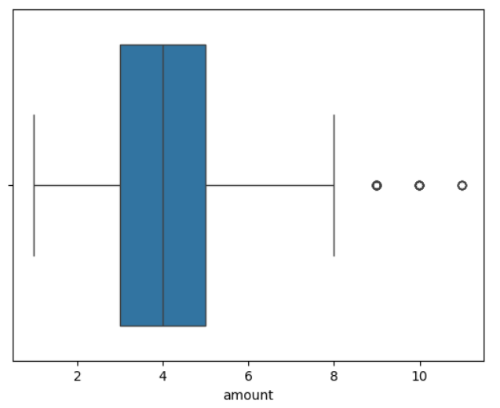
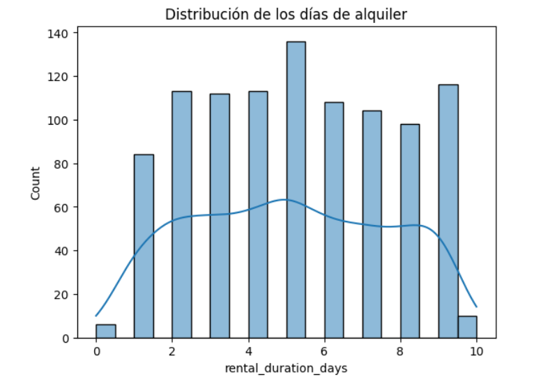
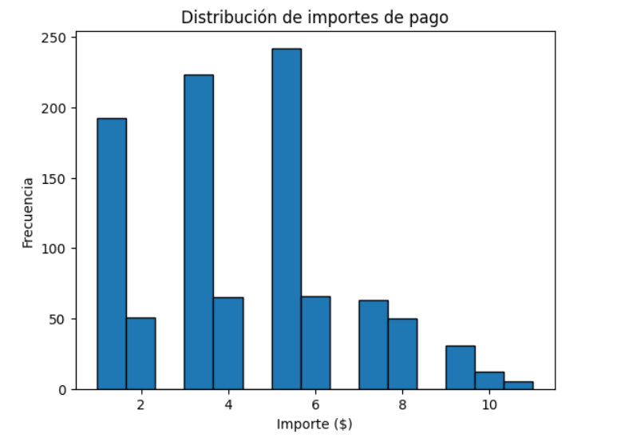

#  Proyecto: Flujo de datos de SQL a Python (Sakila)
Proyecto que trata sobre conectar python con base de datos SQL.

---

## Autores
### Proyecto 3 - Grupo 3
- Rita Isabel Romero Ruiz  
- Marco Ohimai Imouokhome 
- Irene Condado Alcantarilla 

---

## Descripción
Este proyecto consiste en extraer, limpiar y analizar datos de la base de datos **Sakila**, siguiendo un flujo completo de trabajo desde SQL hasta Python.

Se generan varios dataframes mediante consultas SQL, se selecciona uno para limpieza, y posteriormente se analiza en **Google Colab**.

---

## Flujo del proyecto

- Preparación del entorno  
- Extracción de datos en SQL  
- Limpieza de datos en SQL  
- Exportación del dataset  
- Procesamiento en Python (Colab)  
- Visualización y análisis  

---

## Preparación del entorno

### Base de datos 
- Importación de la base de datos **Sakila**  
- Exploración de tablas y relaciones  


### Extracción de datos en SQL

Se generaron tres dataframes mediante JOIN:

- Dataframe 1: Actividad de clientes ✅ (seleccionado)
customer, address, city, country, rental, payment

- Dataframe 2: Catálogo de películas
film, film_category, category, language, inventory

- Dataframe 3: Elenco y popularidad
film, actor, film_actor

### Limpieza en SQL (Dataframe seleccionado)

Se trabajó con Dataframe 1: Actividad de clientes

- Reglas aplicadas:
Eliminación de registros con rental_id o payment_id nulos
Filtrado de pagos (amount > 0)
Solo alquileres completados (return_date IS NOT NULL)
Validación de fechas (rental_date < return_date)
Normalización de texto (LOWER(), TRIM())
Joins consistentes evitando duplicados

- Columna derivada:
DATEDIFF(return_date, rental_date) AS rental_duration

### Exportación de datos

El dataset limpio se exporta desde la base de datos SQL a un archivo en formato CSV.

Para generar el archivo, ejecuta el script principal del proyecto:

```bash
python main.py
```

Una vez ejecutado, el archivo resultante se guardará automáticamente en la carpeta **data/**, si no existe la creará. Para su uso posterior en Python.

--- 

### Procesamiento en Google Colab: Python / Análisis

- Uso de **Google Colab**

Importación y Limpieza de Datos

El dataset final consolidado (`dataframe_final`) cuenta con un total de **16,044 registros** y **14 columnas**. Se integró información de alquileres, pagos, clientes, inventario, películas y ubicaciones geográficas.

Durante la fase de limpieza y preparación se realizaron las siguientes acciones:

* **Conversión de Tipos:** Transformación de las variables de fecha (`rental_date`, `return_date`, `payment_date`) a formato `datetime`.

* **Normalización de Texto:** Limpieza de strings y estandarización en columnas como nombres, apellidos, ciudades y países.

* **Tratamiento de Nulos:** Se identificaron **183 valores nulos** en la fecha de devolución (`return_date`), los cuales corresponden a películas que aún no han sido devueltas por los clientes.

---

# Gráfica para identificar el outlier en la columna "amount".



---

# Gráfica de los días de alquiler



---

# Gráfica de la distribución de los importes de pago



--- 

# Estructura

```
📦 Estructura del repositorio
├── data/
├── notebooks/
├────── Dataframe_final.ipynb
├── assets/
├────── alquiler.png
├────── amount.png
├────── pago.png
├── sql/
├────── DataFrame2.sql
├────── DataFrame3.sql
├────── Dataframe1.sql
├── src/
├────── config.py
├────── main.py
├── .env_example
├── .gitignore
├── LICENSE
├── README.md
├── requirements.txt
```
---

### Tecnologías utilizadas
- MySQL / Workbench
- Python (Pandas, NumPy, Matplotlib, Seaborn)
- Google Colab
- GitHub

---

### Cómo ejecutar el proyecto

Clonar el repositorio:
```
git clone https://github.com/Bootcamp-DA-P2/flujo_de_datos_SQL_Python1_Grupo3.git
```

- Ejecutar las queries SQL
- Exportar el dataset limpio
- Abrir el notebook en Google Colab
- Ejecutar las celdas en orden

---

## Conclusiones Generales
- El proyecto demuestra un flujo ETL eficiente entre SQL y Python, logrando procesar más de 16 mil registros con buen rendimiento y detectando alquileres activos clave para el control de inventario.

- Además, los datos muestran que predominan ingresos bajos y medios con algunos valores premium, mientras que los clientes tienden a agotar los plazos de alquiler. El dataset final es limpio, consistente y listo para análisis avanzados o dashboards.

--- 
